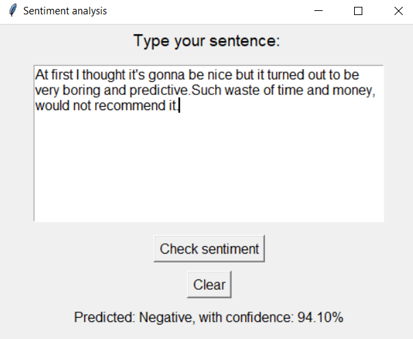
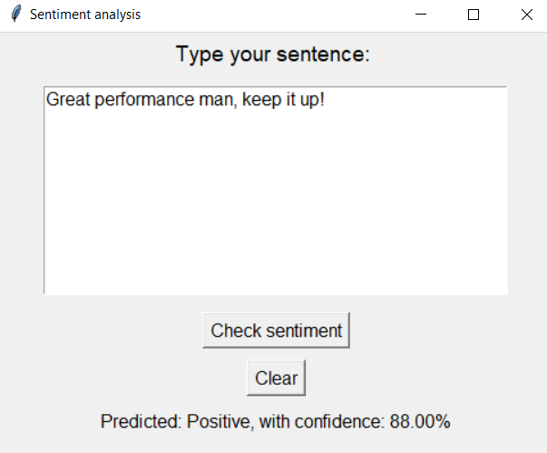
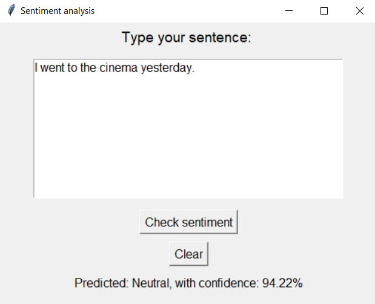

# Sentiment Analysis 

## ABOUT
This project was made as part of my bachelor's thesis application entitled "The use of recurrent neural networks for sentiment analysis". Its main task is to define the polarity of the text entered by the user against a three-point scale: negative, positive and neutral.
In order to do so, the model was built using two Bidirectional LSTM layers, achieving 83% accuracy on the validation set and around 82.5% on the testing dataset.

## Datasets used in the project:
- IMDB Dataset - dataset consisting of 50,000 opinions and reviews on films from the international film database IMDB, divided into two classes: positive and negative,
- Twitter airline sentiment - dataset that contains 14,640 statements from twitter about attitudes towards American airlines, classified into three categories: positive, negative and neutral,
- Pre-processed twitter tweets - preprocessed dataset made up of three separate files, where each file contains about 1,500 sentences belonging to adequate classes: positive, negative and neutral

## Results of the application
### Negative sentiment prediction

### Positive sentiment prediction

### Neutral sentiment prediction

